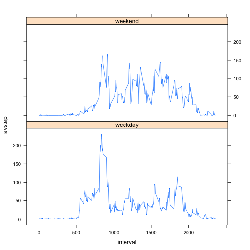

Reproducible Research
Peer Assessment 1

First, the data is loaded into R.  
Dates have been converted from factors into dates

```r
## load data
activitydata <- read.csv("activity.csv")
## convert date factors to date
activitydata$date <- as.Date(activitydata$date,format = "%Y-%m-%d")
```

The following code displays a histogram of the number of steps taken per day then calculates the mean and median total number of steps taken per day

```r
## histogram of total number of steps per day
stepsperday <- tapply(activitydata$steps,activitydata$date,sum,na.rm = TRUE)
hist(stepsperday)
```

 

```r
##display mean and median step per day
mean(stepsperday)
```

```
## [1] 9354.23
```

```r
median(stepsperday)
```

```
## [1] 10395
```

The following code displays a plot of the 5-minute interval and the average number of steps taken, averaged across all days

```r
## average steps per 5 min period
averagestepsper5minuteperiod <- tapply(activitydata$steps,activitydata$interval,mean,na.rm = TRUE)
plot(row.names(averagestepsper5minuteperiod),averagestepsper5minuteperiod, type='l',
     main="average steps for 5 minute period", ylab = "steps", xlab="period")
```

 

The 5-minute interval which has the greatest number of average steps is found to occur at 08.35 by the following R code

```r
## interval with max steps
which.max(averagestepsper5minuteperiod)
```

```
## 835 
## 104
```

The original data contains missing values.  The following R Code displays the number of rows with missing data

```r
## count rows with missing (NA) values
sum(is.na(activitydata$steps))
```

```
## [1] 2304
```

The following R Code produces a dataset with missing values populated by replacing NA entries with the average number of steps for that 5-minute period

```r
## replace each NA value with the mean for that 5 min period
filledindata <- activitydata
toreplace <- which(is.na(activitydata$steps))

for (i in toreplace) {
    time <- filledindata[i,3]
    av <- averagestepsper5minuteperiod[row.names(averagestepsper5minuteperiod)==time]
    filledindata$steps[i] <- av
}
```

The following code displays a histogram of the number of steps (now with missing values populated) taken per day and calculates the mean and median total number of steps (now with missing values populated) taken per day

```r
## histogram of total number of steps per day
stepsperday <- tapply(filledindata$steps,filledindata$date,sum,na.rm = TRUE)
hist(stepsperday)
```

 

```r
##display mean and median step per day
mean(stepsperday)
```

```
## [1] 10766.19
```

```r
median(stepsperday)
```

```
## [1] 10766.19
```
It can be seen that the mean and median are now the same value and are greater than the mean and median calculated prior to replacing missing values

The following code displays a panel plot of the number of steps (now with missing values populated) taken in each 5-minute interval comparing the average value for a weekday with the average value for a weekend

```r
## new factor variable weekday/weekend
day <- weekdays(filledindata$date)
weekends <- grepl ("Saturday|Sunday",day)
day[weekends] <- "weekend"
day[!weekends] <- "weekday"
day <- factor(day)
filledindata <- cbind(filledindata,day)

## average steps for weekend and weekday
library(dplyr)
avst <- group_by(filledindata,interval, day)
avst <- summarize(avst, avstep = mean(steps))

## plot using lattice system
library(lattice)
p <- xyplot(avstep ~ interval | day, avst,
            layout = c(1,2),type="l")
print (p)
```

 

